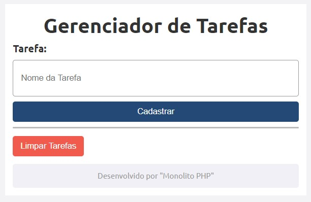

# Gerenciador-de-Tarefas
<!--# Índice 

* [Sistema de Cálculo Salarial](#sistema-de-cálculo-salarial)
* [Introdução](#introdu%C3%A7%C3%A3o)  
* [Funcionalidades](#funcionalidades)  
* [Tecnologia Utilizadas](#tecnologia-utilizadas)  
* [Fontes Consultadas](#fontes-consultadas)  
* [Autor](#autor)
  -->

Projeto criado com base em atividade de Programação Web II. Escola Social Marista Ir. Acácio - Ensino Médio Técnico. Para avalição final do trimestre.

## Introdução
Gerenciador de Tarefas, 

## Funcionalidades
Se é possivel adicionar tarefas e limpar as tarefas colocadas.

Adicionando:

Limpando:

### Explicando Recursos do PHP
Aqui deixarei a explicação de algumas recursos usados:

'''isset''' :

'''$SESSION''' :

'''foreach''' : Repete o trabalho quantas vezes necessário, indo de acordo com algum array  

'''session_start()''' :

'''array()''' :

'''$_GET''' : Método de envio do PHP para o HTML.

'''array_push()''' :

'''var_dump()''' : Mostra o que a váriavel está armazenando

'''unset()''' :

## Tecnologia Utilizadas
- :heavy_check_mark: [HTML]
- :heavy_check_mark: [CSS]
- :heavy_check_mark: [PHP]
- :heavy_check_mark: [GIT]

## Créditos
Desenvolvedor do Código: Monolito PHP
- Canal - Monolito PHP: [youtube.com](https://www.youtube.com/channel/UCSCKCO6nnrtpUZlexHRpJuA)
- Vídeo Base: [youtube.com](https://www.youtube.com/watch?v=dJ49I-QYYUk&ab_channel=MonolitoPHP)

## Autor
Caio Estevão
- Github: [github.com](https://github.com/Caioestevao1000)